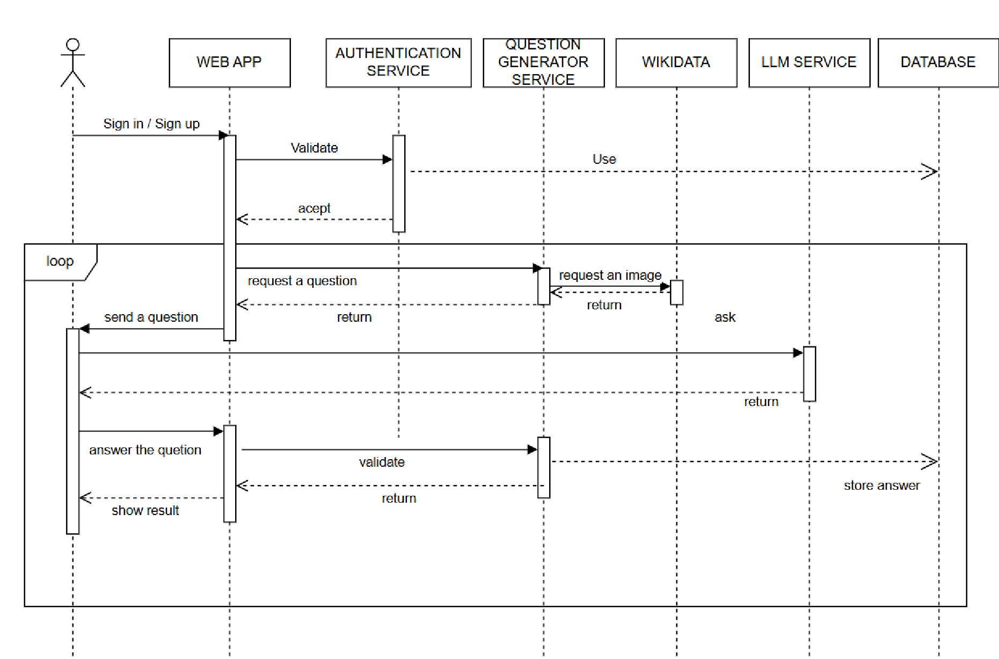

ifndef::imagesdir[:imagesdir: ../images]

[[section-runtime-view]]
== Vista de ejecución

En el diagrama anterior se muestra como un usuario válido, interactúa con la aplicación.

Tras iniciar sesión la aplicación genera una pregunta con su imagen correspondiente y se la mostrará al usuario. El usuario podrá responder a la pregunta, haciendo uso o no del LLM, y una vez que responda la pregunta, la aplicación le mostrará si la respuesta fue correcta o no.
