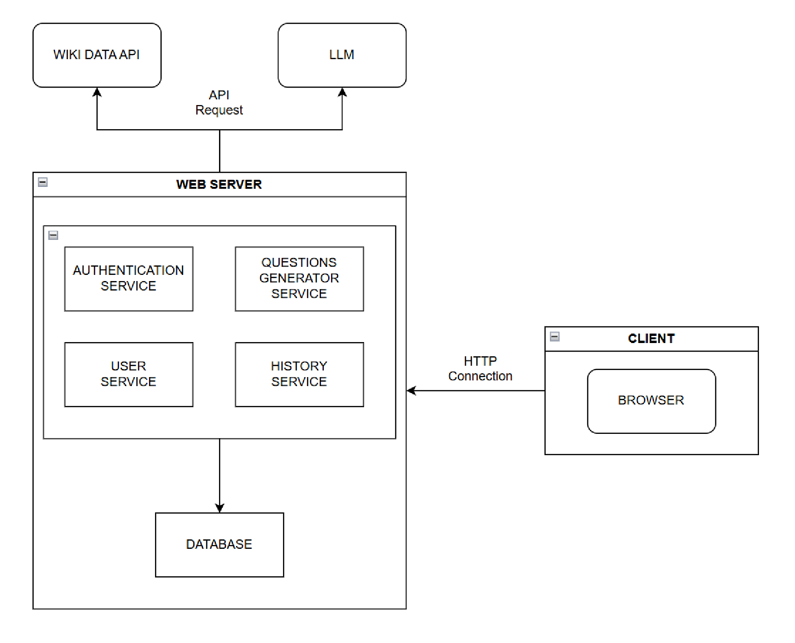

ifndef::imagesdir[:imagesdir: ../images]

[[section-deployment-view]]

== Vista de despliegue

Motivación::

El objetivo de la vista de despliegue es conocer cómo el producto software se distribuye sobre la infraestructura hardware. Siendo importante conocer su vista por los siguientes motivos:

* Facilitar la identificación de posibles cuellos de botella y puntos de fallo.
* Proveer una base para la planificación de la capacidad y la escalabilidad.
* Ayudar en la resolución de problemas y en el mantenimiento del sistema.

Mapeo de los servicios a la infraestructura::

Servicios API de terceros:::
* *_WIKIDATA API_*: Servidor API externo que provee información gráfica para las preguntas.
* LLM: Chat Bot que ofrece ayuda al usuario.

Servicios de la aplicación en servidor propio:::
* *_Authentication Service_*: Valida que el usuario esté autenticado.
* *_User Service_*: Provee información de los usuarios.
* *_Questions Generator Service_*: Genera preguntas para el usuario.
* *_History Service_*: Guarda el historial de preguntas del usuario.
* *_Database_*: Base de datos que almacena la información de los usuarios y las preguntas.

Servicio en el cliente:::
* *_Web Browser_*: Interfaz de usuario que permite la interacción del usuario con el sistema.

